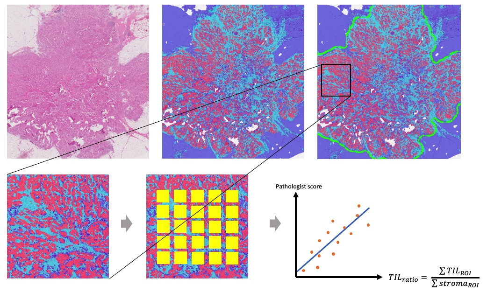

# Spotlight Pathology TIGER Algorithm

This algorithm won 2nd place in the survival prediction leaderboard (L2) of the
[TIGER Grand Challenge](https://tiger.grand-challenge.org/Home/), 
and tied in 4th place in the computer vision leaderboard (L1).



Algorithm Description
---------------------
The detailed algorithm description can be found 
[here](https://rumc-gcorg-p-public.s3.amazonaws.com/evaluation-supplementary/636/8bdfff21-5369-4e14-8017-045d7261b152/TIGER_Spotlight_Pathology.pdf).

Run the algorithm
-----------------
- Add a [TIGER](https://tiger.grand-challenge.org/Data/) 
slide and a tissue mask in the [testinput](testinput) directory.

- Download the model files & pretrained weights from [google drive](https://drive.google.com/drive/folders/1_S9FB-igaXu0icKwRh-j5aYMX8dehRD5?usp=sharing)
and place them in the 
[segmentation model files directory](inference_docker/tigeralgorithmexample/challenge_utils/models/segmentation/model_files)
and the [detection model files directory](inference_docker/tigeralgorithmexample/challenge_utils/models/detection/model_files).

- If necessary, run `chmod 664` on the `.pth` pretrained weights to ensure
correct permissions.

- Use the [test script](inference_docker/test.sh) which will build the docker 
container, run the algorithm on the slide and output the results in a newly 
created `inference_docker/results` folder. 
Run the script by:
```
./test.sh
```

*Prerequisites to run the algorithm*:
- Docker
- The [Dockerfile](inference_docker/Dockerfile) and 
[test script](inference_docker/test.sh) assume a GPU compatible with CUDA is
available. 

Export the container
--------------------
Export the algorithm to an .tar.xz file by running the
[export bash script](inference_docker/export.sh):
```
./export.sh
```

Structure of this repository
---------------------------------------
This repository contains the following.

### inference_docker
All the code needed to build and run the docker container that performs
inference on Grand Challenge.

### train
Training scripts used to build the detection and segmentation models.

### testinput
A placeholder empty directory where users can place example slides and process them 
by running the algorithm (see [Run the algorithm](#run-the-algorithm)).


Acknowledgement
---------------
This code was made by the team at Spotlight Pathology Ltd.
